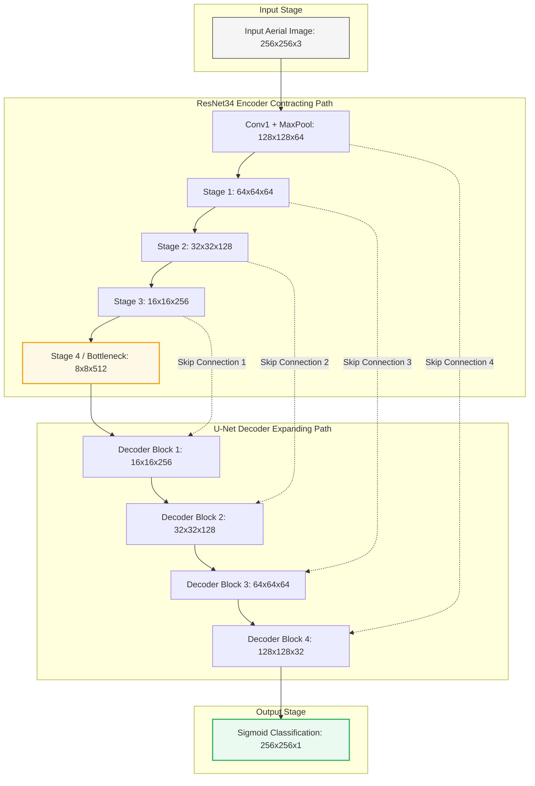
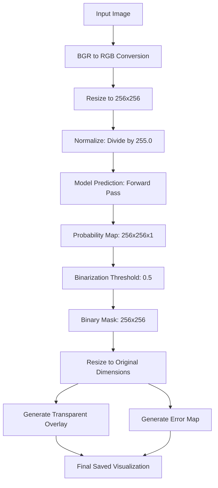

# Flood-Seg-Net: Semantic Segmentation of Flooded Regions in Aerial Imagery

<p align="center">
  
  <br>
  
</p>

### Model Performance & Configuration Summary

| Metric / Configuration | Value / Setting |
| :--- | :--- |
| **Validation F1 Score (Dice)** | 0.7531 (0.75) |
| **Validation IoU Score** | 0.6057 (0.61) |
| **Best Test Image (2001.jpg) Dice / IoU** | 0.9825 / 0.9656 |
| **Backbone Encoder** | ResNet34 U-Net (ImageNet Transfer Learning) |
| **Training Epochs / Batch Size** | 30 / 8 |
| **Loss Function** | Combined Binary Cross-Entropy + Dice Loss |
| **Hardware Platform** | Google Colab T4 GPU |

---

## Project Overview
This repository contains a deep learning system for the binary semantic segmentation of flooded regions from aerial imagery. The model classifies each pixel as either **Flood** or **Background**, allowing precise spatial mapping of flood zones. The system was trained on the Flood Area Segmentation dataset, achieving robust boundary delineation.

---

## Repository Structure

```
flood-seg-net/
├── data/
│   ├── Image/                 # Raw aerial JPEG images (290 files)
│   ├── Mask/                  # Ground truth binary PNG masks (290 files)
│   └── metadata.csv           # Filename mappings
├── tests/
│   ├── 2001_mask.png          # Output binary mask for image 2001.jpg
│   ├── 2001_visualization.png # 5-panel visualization for image 2001.jpg
│   ├── 3039_mask.png          # Output binary mask for image 3039.jpg
│   └── 3039_visualization.png # 5-panel visualization for image 3039.jpg
├── best_model_colab.keras     # Trained weights (ResNet34 U-Net)
├── flood-seg-net.ipynb        # Training pipeline notebook
├── inference.py               # Single-image inference script
├── test.py                    # Batch evaluation script
└── readme.md                  # Project documentation (this file)
```

---

## Important links
 - *To download my trained weights for this segmentation task, download from google drive @ https://drive.google.com/file/d/17b_tmkTXwPgSAUQb5xT-WjbQa4EvzOjx/view?usp=sharing*

  - *To download the dataset from kaggle @ https://www.kaggle.com/datasets/faizalkarim/flood-area-segmentation*

---

## Technical Architecture

The system utilizes a symmetric U-Net encoder-decoder network to capture both context and fine localization:



* **U-Net Architecture:** The contracting path extracts context and features, while the expanding path restores spatial dimensions. Skip connections pass high-resolution details directly from the encoder to the decoder, enabling precise flood boundary reconstruction.
* **ResNet34 Encoder:** Rather than training from scratch, I used a pretrained ResNet34 encoder. Residual learning shortcuts stabilize training, while ImageNet transfer learning provides robust, generalizable visual features (edges, textures) that prevent overfitting on our small dataset.
* **Combined BCE + Dice Loss:** BCE evaluates independent pixel classification confidence, ensuring stable gradient updates. Dice Loss measures the global overlap between prediction and ground truth, mitigating the effects of class imbalance where background pixels dominate.

---

## My Engineering Journey

### The Validation Plateau & Breakthrough
I trained my ResNet34 U-Net on a dataset of 290 aerial images (split into 232 training and 58 validation images). During training on a Google Colab T4 GPU, I experienced a frustrating plateau: the validation F1 score stagnated between 0.57 and 0.58 from Epoch 3 all the way through Epoch 23, even though my training F1 steadily climbed from 0.79 to 0.88. It appeared that the model had hit a generalization limit or was stuck in a local minimum.

However, I persevered and let the training run continue. Around Epoch 24, the model suddenly broke out of this plateau. The validation F1 score began rising rapidly: jumping to 0.59 in Epoch 24, 0.66 in Epoch 26, 0.71 in Epoch 29, and finally peaking at 0.7531 (with a validation IoU of 0.6057) at Epoch 30.

---

## Inference Pipeline



### Pipeline Steps
1. **Preprocessing:** Convert the input image from BGR to RGB, resize it to 256 x 256 pixels, and normalize pixel values to a 0.0–1.0 range.
2. **Forward Pass:** The ResNet34 U-Net generates a probability map.
3. **Postprocessing:** Apply a 0.5 binarization threshold, resize the mask back to the original image dimensions (nearest-neighbor), and blend it with the original image (40% original image, 60% blue mask) for visual overlay. If ground truth is provided, an error map is generated.

---

## Empirical Results and Qualitative Analysis

Below are the evaluation results for the top 5 test images (excluding images with less than 10% flood coverage to focus on challenging cases):

| Rank | Image File | Dice (F1) Score | IoU Score | Flood Coverage (%) |
| :--- | :--- | :---: | :---: | :---: |
| 1 | `2001.jpg` | 0.9825 | 0.9656 | 86.7% |
| 2 | `3039.jpg` | 0.9659 | 0.9340 | 87.9% |
| 3 | `13.jpg` | 0.9619 | 0.9266 | 84.3% |
| 4 | `2016.jpg` | 0.9476 | 0.9004 | 49.8% |
| 5 | `3030.jpg` | 0.9472 | 0.8996 | 84.1% |

* **Error Map Legend:** Green represents True Positive (correctly segmented flood), Red represents False Positive (model incorrectly predicted flood), and Blue represents False Negative (model missed flood).
* **Visual Evaluation:** The model excels at segmenting broad, continuous flooded areas (as seen in `2001.jpg`). Minor boundary noise occurs near dense vegetation or complex structural borders (as seen in `3039.jpg`).


## Future Work
1. **Attention U-Net:** Integrate self-attention gates to skip connections to focus features on boundaries.
2. **DeepLabV3+ Exploration:** Evaluate dilated convolutions and Atrous Spatial Pyramid Pooling (ASPP) to capture multi-scale context.
3. **Edge Deployment:** Quantize weights using TFLite to INT8 precision for real-time drone inference.
