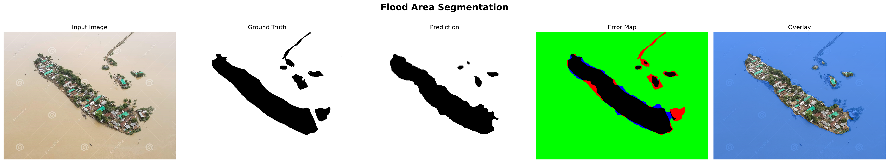
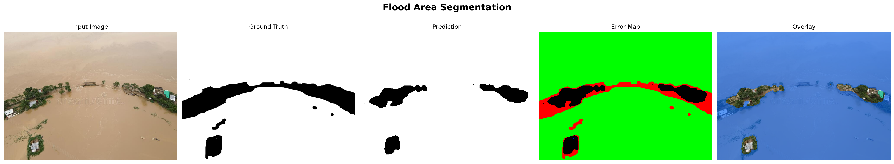
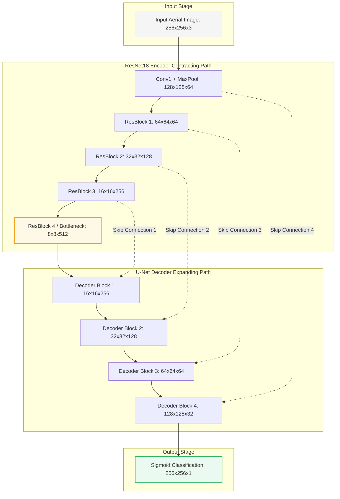
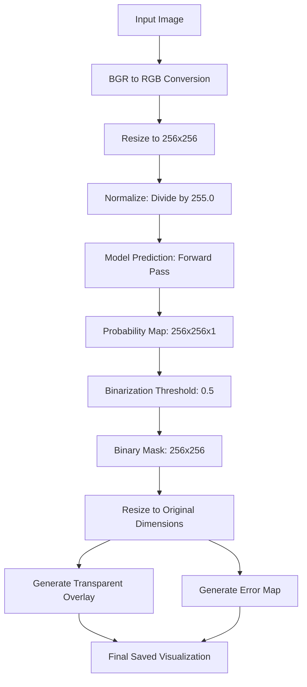

# Flood-Seg-Net: Semantic Segmentation of Flooded Regions in Aerial Imagery

<p align="center">
  
  
</p>

This repository contains the implementation of a deep learning system for the binary semantic segmentation of flooded regions from aerial imagery. The model utilizes a U-Net architecture paired with a pretrained ResNet18 encoder (transfer learning) to produce high-precision flood boundary masks.

The model was trained on the Flood Area Segmentation dataset, achieving a validation F1 score of approximately 0.75 and a validation Intersection over Union (IoU) of approximately 0.60.

---

## Technical Architecture Deep-Dive

### Semantic Segmentation for Flood Mapping
Semantic segmentation refers to the process of classifying each individual pixel in an image into a corresponding class label. Unlike image classification (which assigns a single label to an entire image) or object detection (which identifies objects using coarse bounding boxes), semantic segmentation provides pixel-level delineations. 

For flood mapping, pixel-level resolution is crucial. Floods are amorphous, non-rigid bodies of water that do not conform to structured bounding boxes. They flow dynamically across terrain, blocking roads, submerging agricultural fields, and wrapping around structures. Binary semantic segmentation (classifying pixels as either **Flood** [1] or **Background** [0]) is highly suited for this task, enabling emergency responders and rescue teams to compute precise spatial coverage, identify submerged transportation networks, and estimate damage boundaries.



### U-Net Architecture
The network is structured as a symmetric encoder-decoder architecture:
* **Contracting Path (Encoder):** Extracts high-level semantic features from the input image. As the spatial resolution decreases through downsampling operations, the channel dimension increases, capturing context (the "what" of the image).
* **Expanding Path (Decoder):** Progressively upsamples the feature maps (reconstructing spatial dimensions) to match the original input resolution, restoring localization information (the "where" of the image).
* **Skip Connections:** Skip connections concatenate feature maps from the encoder directly to the decoder blocks at corresponding resolutions. Downsampling layers (like max pooling) discard spatial details to gain translation invariance and abstraction. Skip connections bypass the bottleneck, feeding high-frequency, low-level spatial details (such as sharp boundaries, edges, and textures) back to the decoder. This enables the model to accurately reconstruct the exact boundaries of flooded regions.

### ResNet18 Encoder Backbone
Rather than training a U-Net encoder from scratch, this implementation utilizes a pretrained ResNet18 backbone.
* **Residual Learning:** ResNet architectures utilize identity shortcut connections to solve the vanishing gradient problem in deep networks. The block computes a residual function $F(x)$ such that the output is $H(x) = F(x) + x$. This allows gradients to flow directly back through the shortcuts during backpropagation, stabilizing training.
* **Transfer Learning:** The encoder weights are initialized with parameters pretrained on the ImageNet dataset. ImageNet contains over a million natural images, forcing the early layers of ResNet18 to learn highly generalizable visual features (e.g., Gabor-like edge detectors, corners, color gradients, and textures). By utilizing these pretrained feature extractors, the model converges much faster and generalizes far better on small, domain-specific datasets.
* **Why ResNet18:** ResNet18 was selected over deeper architectures (like ResNet34 or ResNet50) to limit model capacity. With only 18 layers, ResNet18 extracts rich feature hierarchies while maintaining a low parameter count, acting as a structural regularizer against overfitting on small datasets.

### Compound Loss Formulation: BCE + Dice Loss
To train the segmentation network, a combined loss function is utilized:
$$\mathcal{L}_{\text{BCE-Dice}} = \mathcal{L}_{\text{BCE}} + \mathcal{L}_{\text{Dice}}$$

#### Binary Cross-Entropy (BCE) Loss
BCE computes the pixel-wise classification loss, evaluating each pixel independently:
$$\mathcal{L}_{\text{BCE}}(y, \hat{y}) = -\frac{1}{N} \sum_{i=1}^{N} \left[ y_i \log(\hat{y}_i) + (1 - y_i) \log(1 - \hat{y}_i) \right]$$
where $y_i \in \{0, 1\}$ is the ground truth label for pixel $i$, $\hat{y}_i \in [0, 1]$ is the predicted probability for pixel $i$, and $N$ is the total number of pixels. BCE provides smooth gradients for optimization but can struggle under severe class imbalance, as the loss is dominated by the background class when the background occupies the majority of the image.

#### Dice Loss
Dice Loss is based on the Dice Coefficient (equivalent to the F1 score), which measures the overlap between the predicted mask and the ground truth mask:
$$\text{Dice}(y, \hat{y}) = \frac{2 \sum_{i=1}^{N} y_i \hat{y}_i}{\sum_{i=1}^{N} y_i + \sum_{i=1}^{N} \hat{y}_i + \epsilon}$$
$$\mathcal{L}_{\text{Dice}}(y, \hat{y}) = 1 - \text{Dice}(y, \hat{y})$$
where $\epsilon = 10^{-7}$ is a smoothing factor. Dice Loss evaluates the prediction globally rather than pixel-by-pixel, mitigating the effects of class imbalance.

#### Synergy of Combined Loss
BCE ensures stable training dynamics and smooth gradient descent in the initial epochs, while Dice Loss optimizes directly for spatial overlap and boundary precision. The combination forces the network to minimize individual pixel errors while maximizing overall structural overlap, preventing the model from falling into local minima where it predicts a blank mask.

### Evaluation Metrics
To measure segmentation quality during validation, two primary metrics are tracked:
* **F1 Score / Dice Coefficient:** Measures the harmonic mean of precision and recall:
$$\text{F1} = \frac{2 \cdot \text{True Positives}}{2 \cdot \text{True Positives} + \text{False Positives} + \text{False Negatives}}$$
* **Intersection over Union (IoU) / Jaccard Index:** Measures the ratio of the intersection area to the union area of the predicted and ground truth masks:
$$\text{IoU} = \frac{\text{True Positives}}{\text{True Positives} + \text{False Positives} + \text{False Negatives}}$$

A validation F1 of 0.75 indicates strong pixel-level recall and precision, meaning the model accurately captures the presence of floodwaters. A validation IoU of 0.60 indicates a solid, consistent overlap between the predicted flood boundaries and the ground truth annotations across diverse terrains.

---

## Engineering Journey and Case Study

The development of this model was an iterative engineering process characterized by regularization tuning, architectural experiments, and infrastructure scaling.

```
       Initial Design                   Model Tuning                     Infrastructure
+--------------------------+    +--------------------------+    +------------------------------+
|   ResNet34 Backbone      |    |   ResNet18 Backbone      |    |     Local CPU Training       |
|   (Severe Overfitting)   |    |    (Reduced Capacity)    |    |   (High iteration bottleneck)|
+------------+-------------+    +------------+-------------+    +--------------+---------------+
             |                               |                                 |
             v                               v                                 v
+------------+-------------+    +------------+-------------+    +--------------+---------------+
|  Train F1: ~0.88         |    |  Train F1: ~0.91         |    |     Google Colab T4 GPU      |
|  Val F1:   ~0.57         |    |  Val F1:   ~0.75         |    |   (Epoch speedup: ~100x)     |
+--------------------------+    +--------------------------+    +------------------------------+
```

### Initial Architecture & Overfitting Analysis
The initial prototype used a **ResNet34** encoder backbone within the U-Net framework. The model was trained using the Adam optimizer and the compound BCE-Dice loss. 

During training, a severe generalization gap was observed:
* **Training F1:** Climbed to $\approx 0.88$
* **Validation F1:** Stagnated at $\approx 0.57$

This large performance gap is a classic indicator of overfitting. The dataset consists of only 290 images (split into 232 training samples and 58 validation samples). ResNet34, with approximately 21 million parameters in its backbone alone, possesses too much capacity for a dataset of this size. Rather than learning general visual features of flooded landscapes (such as water reflectivity, channel structures, and context), the model memorized the specific spatial configurations, noise patterns, and lighting conditions of the 232 training images. 

### Debugging & Training Regularization
To address the overfitting, the training pipeline was regularized and monitored using callbacks:
1. **Model Checkpointing:** Integrated `ModelCheckpoint` to monitor `val_f1-score` and save only the model weights that achieved the highest validation F1 score. This prevented saving model weights from later epochs where the training loss continued to fall but the validation loss deteriorated.
2. **Early Stopping:** Configured `EarlyStopping` with `patience=8` and `restore_best_weights=True`, monitoring `val_f1-score`. This terminated training automatically when validation performance stopped improving, preventing unnecessary training epochs and reducing overfitting.

### Model Refinement: Transition to ResNet18
To structurally regularize the network, the backbone encoder was changed from **ResNet34** to **ResNet18**. 

ResNet18 contains significantly fewer residual blocks and channels, reducing the model's capacity and making it harder to memorize the training data. This change improved generalization:
* The training F1 reached $\approx 0.91$.
* The validation F1 rose to $\approx 0.75$.
* The validation IoU settled at $\approx 0.60$.

By reducing the model's capacity, the validation F1 score improved by 18% absolute (from 0.57 to 0.75), demonstrating that a smaller model was better suited for this limited dataset.

### EfficientNet Experiment Post-Mortem
An attempt was made to replace the ResNet backbone with an **EfficientNet** encoder (such as EfficientNetB0) to leverage mobile-friendly depthwise separable convolutions. However, this experiment encountered three distinct failures:
1. **Broken Pretrained Weight Downloads:** The automated weights download script failed due to deprecated URLs and SSL certificate issues within the legacy `segmentation_models` library's backend.
2. **Encoder-only Compilation:** During configuration, the backbone was accidentally instantiated without the corresponding U-Net decoder blocks, leading to a standard classification network that could not produce 2D spatial masks.
3. **Tensor Shape Mismatch:** When attempting to manually bind the encoder to the decoder, shape mismatch errors occurred. EfficientNet structures downsample feature maps using different stride patterns and block scales compared to ResNet. The decoder's upsampling layers failed to concatenate with the encoder's feature maps because their spatial dimensions did not match (e.g., trying to concatenate a $9 \times 9$ feature map with an $8 \times 8$ feature map).

Debugging these issues required analyzing feature map dimensions at each block boundary, which improved our understanding of contracting-expanding paths and structural constraints in semantic segmentation.

### GPU Acceleration
Initially, the training pipeline was executed on a local CPU. Due to the high computational complexity of backpropagation through deep convolutional neural networks, each epoch took several minutes, limiting the speed of experimentation.

The pipeline was migrated to a Google Colab environment utilizing a **T4 GPU**. The GPU accelerated the matrix multiplications, reducing the epoch step time to between 180ms and 1 second. This allowed for rapid iteration, enabling the completion of hyperparameter sweeps and backbone evaluations in a fraction of the time.

---

## Inference Pipeline

The inference pipeline processes raw aerial images and outputs binarized flood masks alongside visual comparisons.



### Detailed Pipeline Steps
1. **Image Reading:** The input image is loaded via OpenCV (`cv2.imread`).
2. **Color Space Conversion:** OpenCV reads images in BGR format; they are converted to RGB using `cv2.cvtColor` to match the training distribution.
3. **Dimensional Resize:** The image is resized to $256 \times 256$ pixels using bilinear interpolation (`cv2.resize`).
4. **Data Normalization:** Pixel values are cast to float32 and normalized to $[0.0, 1.0]$ by dividing by 255.0.
5. **Model Evaluation:** The image is expanded to batch shape $(1, 256, 256, 3)$ and passed through the ResNet18 U-Net, returning a probability map.
6. **Binarization:** A threshold of $0.5$ is applied; values above $0.5$ are mapped to 255 (flooded) and values below to 0 (background).
7. **Spatial Upsampling:** The mask is resized back to the original image dimensions using nearest-neighbor interpolation (`cv2.INTER_NEAREST`) to preserve sharp boundary transitions without introducing interpolation artifacts.
8. **Visual Overlay:** A translucent blue mask is blended with the original image:
$$\text{Overlay} = 0.4 \times \text{Original Image} + 0.6 \times \text{Flood Color [0, 100, 255]}$$
9. **Error Map Generation:** If ground truth is provided, an error map is constructed to evaluate predictions.

---

## Empirical Results and Qualitative Analysis

### Quantitative Performance
The model evaluation script (`test.py`) filters out images with less than 10% flood coverage to focus on challenging areas. The overall evaluation yields the following metrics:

| Metric | Performance |
| :--- | :--- |
| **Validation F1 Score (Dice)** | $\approx 0.753$ |
| **Validation IoU Score** | $\approx 0.606$ |

Below are the evaluation results for the top 5 test images:

| Rank | Image File | Dice (F1) Score | IoU Score | Flood Coverage (%) |
| :--- | :--- | :---: | :---: | :---: |
| 1 | `2001.jpg` | 0.9825 | 0.9656 | 86.7% |
| 2 | `3039.jpg` | 0.9659 | 0.9340 | 87.9% |
| 3 | `13.jpg` | 0.9619 | 0.9266 | 84.3% |
| 4 | `2016.jpg` | 0.9476 | 0.9004 | 49.8% |
| 5 | `3030.jpg` | 0.9472 | 0.8996 | 84.1% |

### Qualitative Visualizations

The following subplots demonstrate the model's predictions compared to the ground truth masks and show the corresponding error maps.

#### Best Case Evaluation: Image 2001.jpg (Dice = 0.9825, IoU = 0.9656)
This image features extensive flood coverage across open terrain. The model reconstructs the flood boundaries with high fidelity, as indicated by the minimal error map noise.

<p align="center">
  
</p>

#### High-Performance Evaluation: Image 3039.jpg (Dice = 0.9659, IoU = 0.9340)
This image evaluates the model's ability to segment boundaries near vegetation and high-frequency structures. The model accurately identifies the main flood areas while exhibiting minor false positive noise at the boundaries.

<p align="center">
  
</p>

#### Error Map Color Legend
The error maps utilize color coding to highlight correct and incorrect pixel classifications:
* **Green (True Positive):** Pixels correctly identified as flooded by both the model and the ground truth.
* **Red (False Positive):** Pixels incorrectly identified as flooded (predicted as flood by the model, but annotated as background in the ground truth).
* **Blue (False Negative):** Pixels incorrectly identified as background (predicted as background by the model, but annotated as flood in the ground truth).

---

## Repository Structure

```
flood-seg-net/
├── data/
│   ├── Image/                 # Raw aerial JPEG images (290 files)
│   ├── Mask/                  # Ground truth binary PNG masks (290 files)
│   └── metadata.csv           # Maps image filenames to mask filenames
├── tests/
│   ├── 2001_mask.png          # Output binary mask for image 2001.jpg
│   ├── 2001_visualization.png # 5-panel subplot for image 2001.jpg
│   ├── 3039_mask.png          # Output binary mask for image 3039.jpg
│   └── 3039_visualization.png # 5-panel subplot for image 3039.jpg
├── best_model_colab.keras     # Trained weights checkpoint (ResNet18 U-Net)
├── flood-seg-net.ipynb        # Training pipeline notebook
├── inference.py               # Single-image inference script
├── test.py                    # Batch evaluation and metrics generation script
├── .gitignore                 # Excludes cache files and temporary outputs
└── readme.md                  # Project documentation (this file)
```

### Script Directory Purpose
* `flood-seg-net.ipynb`: Google Colab notebook for the training pipeline. It handles loading data, setting up TF datasets, compiling the ResNet18 U-Net model with combined loss, defining training callbacks, fitting the model for 30 epochs, and exporting the trained keras weights.
* `inference.py`: Run this script to generate predictions on individual images. It loads the saved model, resizes the input image, runs inference, applies thresholding, creates overlays and error maps, and saves the final visualizations.
* `test.py`: Evaluates the model across the test set. It loads images, ignores those with low flood coverage (under 10%), computes Dice and IoU scores, displays the top 20 performing images, and saves the visualization for the best-performing image.

---

## Training Configuration

| Parameter | Configuration Value |
| :--- | :--- |
| **Input Shape** | $256 \times 256 \times 3$ |
| **Batch Size** | 8 |
| **Optimizer** | Adam (Learning Rate = 0.001) |
| **Loss Function** | Binary Cross-Entropy + Dice Loss |
| **Epochs** | 30 |
| **Callbacks** | `ModelCheckpoint`, `EarlyStopping` (Patience = 8) |
| **Dataset Size** | 290 total images (232 Train / 58 Validation) |
| **Hardware Platform** | Google Colab T4 GPU |

---

## Future Work

1. **Backbone Evaluation:** Re-evaluating EfficientNet-B0 or ResNeXt encoders by establishing clean dependency versions and resolving the shape alignment issues inside the decoder.
2. **Attention U-Net Integration:** Adding self-attention gates to the U-Net skip connections to suppress activations in irrelevant background regions and focus feature representations on flood boundaries.
3. **DeepLabV3+ Exploration:** Implementing a DeepLabV3+ model with dilated (atrous) convolutions and Atrous Spatial Pyramid Pooling (ASPP) to capture multi-scale contextual features without losing spatial resolution.
4. **Data Augmentation:** Applying random rotations, horizontal/vertical flips, and color jittering to regularize training and mitigate the effects of the small dataset size (290 images).
5. **Test-Time Augmentation (TTA):** Running inference on multiple augmented variations of a single image and averaging the output probability maps to produce more stable masks.
6. **Edge Optimization:** Quantizing the model using TensorFlow Lite (TFLite) to INT8 precision for real-time inference on edge computing devices, such as search-and-rescue drones.

---

## References

1. **U-Net:** Ronneberger, O., Fischer, P., & Brox, T. (2015). *U-Net: Convolutional Networks for Biomedical Image Segmentation*. arXiv preprint arXiv:1505.04597.
2. **ResNet:** He, K., Zhang, X., Ren, S., & Sun, J. (2016). *Deep Residual Learning for Image Recognition*. In Proceedings of the IEEE conference on computer vision and pattern recognition (CVPR).
3. **Flood Area Segmentation Dataset:** Faizal Karim. Kaggle. [Flood Area Segmentation Dataset](https://www.kaggle.com/datasets/faizalkarim/flood-area-segmentation).
4. **TensorFlow:** Abadi, M., et al. (2015). *TensorFlow: Large-Scale Machine Learning on Heterogeneous Systems*. Software available from tensorflow.org.
5. **Segmentation Models Library:** Pavel Yakubovskiy. [segmentation_models](https://github.com/qubvel/segmentation_models) GitHub Repository.